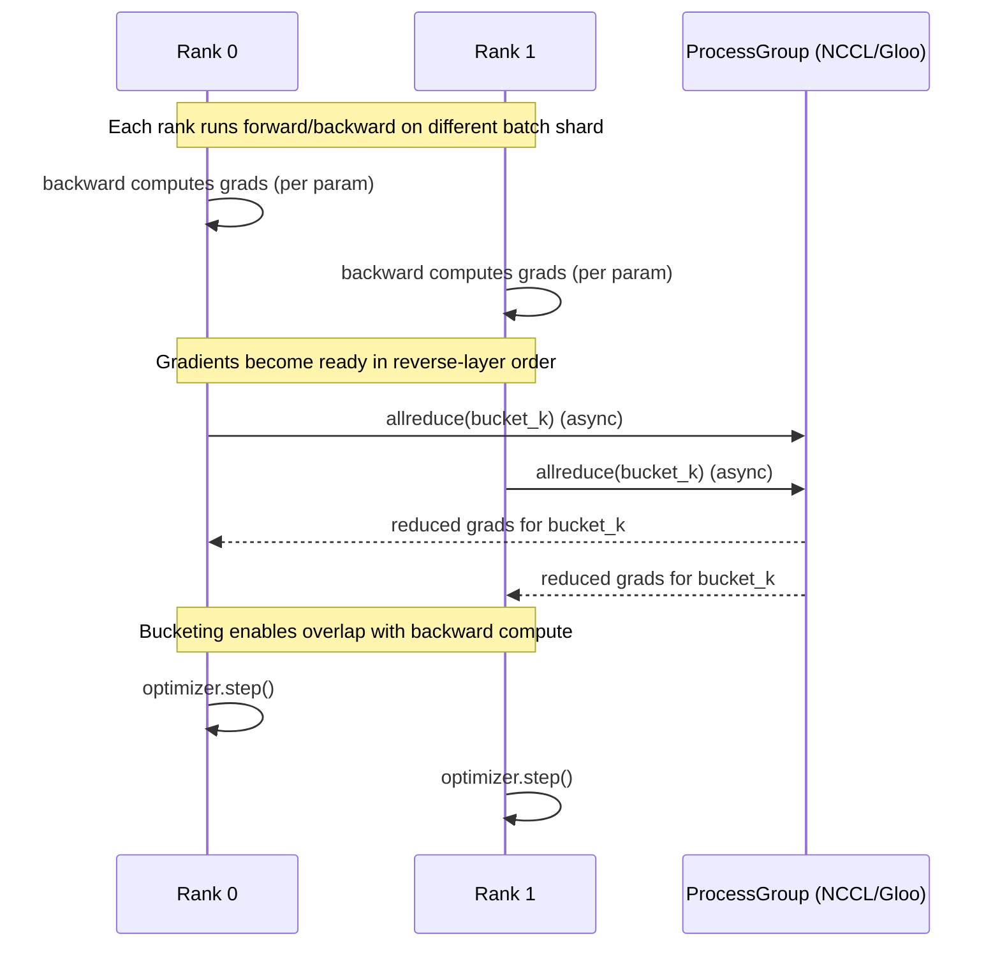

# PyTorch-Focused Interview Question Bank for AI Scientist and Research Engineer Roles

## Executive summary

PyTorch interviews for AI Scientist / Research Engineer roles at frontier labs and large-scale AI orgs (Meta, Google, Mistral, OpenAI, and peers) concentrate on whether you can **reason about correctness (autograd, numerics, reproducibility), scale training (DDP/FSDP/TP/PP), and deliver performance (profiling, torch.compile, kernel choices, memory discipline)**—often under ambiguity and partial information. This aligns with the public emphasis on distributed ML systems and large-scale training in role descriptions (e.g., OpenAI Research Engineer) and PyTorch/Meta’s published work on distributed performance and sharding. citeturn8search3turn15search1turn5search8turn0search17turn12search2

The highest-yield topics to expect repeatedly are: **(a) tensor semantics & views/strides, (b) autograd graph/leaf tensors/hooks/custom backward, (c) determinism & debugging NaNs/Infs, (d) performance profiling + torch.compile graph breaks, and (e) distributed training primitives (DDP buckets, FSDP sharding/offload, tensor/pipeline parallel basics)**. These map directly to official PyTorch docs/tutorials on autograd internals, DDP bucketing/overlap, FSDP CPU offload, profiler usage, torch.compile/torch.export behavior, and reproducibility controls. citeturn9search2turn0search17turn13view0turn1search3turn12search2turn14search2turn16search0

Company emphasis differs mainly by *where they sit on the research↔infrastructure spectrum*: OpenAI and Google frequently highlight **kernels/compilers/performance and massive distributed systems**, Meta strongly emphasizes **PyTorch-native distributed scaling (DDP/FSDP/TorchTitan) and production-grade performance tooling**, and Mistral (based on its open-source inference and finetuning code) trends toward **transformer efficiency, inference constraints, and pragmatic training/finetuning engineering**. citeturn8search3turn8search5turn6search2turn6search0turn5search8turn7search0turn7search1

Assumptions and scope: this report is **PyTorch-centric** and assumes you already have intermediate-to-advanced PyTorch experience. Difficulty, “time-to-answer,” and “study time” are heuristic estimates for interview prep (not official standards). Company-specific emphasis is inferred from **public job postings, official docs, and engineering blog posts**, not internal interview loops. citeturn8search3turn15search1turn6search2turn5search8

## How to use this question bank and priority rubric

**Priority (H/M/L)** in the tables is intended to reflect *expected interview frequency + leverage*:  
High = shows up across many teams/levels and unlocks many follow-ups; Medium = common but more team-dependent; Low = specialized (still valuable for infra/kernel-heavy roles).

Role-focus tags:
- **Research**: experiment design, numerics, ablations, reproducibility, model behavior.
- **Applied**: training loop hygiene, practical debugging, deployment constraints, metrics.
- **Infra**: profiling, compilation, kernels, distributed systems, performance at scale.

This aligns with the public framing that many research engineering roles sit between research and production, requiring strong engineering rigor and systems thinking (e.g., Meta RE descriptions and third-party but widely used role guides), plus OpenAI’s explicit focus on “massive-scale distributed machine learning systems.” citeturn15search1turn15search0turn8search3

## Category mastery matrix

The table below summarizes typical difficulty mix and suggested study time *for an already intermediate/advanced PyTorch user* (rough ranges). References are **primary sources** you should treat as canonical.

| Category | Typical difficulty mix (E/M/H) | Suggested study time (advanced candidate) | Key primary references (inline URLs) |
|---|---:|---:|---|
| Theory: tensors, autograd, numerics | 40/45/15 | 2–4 days | https://docs.pytorch.org/docs/stable/autograd.html citeturn0search8; https://docs.pytorch.org/docs/stable/generated/torch.Tensor.view.html citeturn11search0; https://docs.pytorch.org/docs/stable/notes/broadcasting.html citeturn11search1 |
| Debugging: failure modes, determinism, reproducibility | 30/50/20 | 3–6 days | https://docs.pytorch.org/docs/stable/notes/randomness.html citeturn14search2; https://docs.pytorch.org/docs/stable/generated/torch.use_deterministic_algorithms.html citeturn0search3; https://docs.pytorch.org/docs/stable/notes/autograd.html citeturn4search16 |
| Performance: profiler, bottlenecks, fusion, torch.compile | 20/50/30 | 1–2 weeks | https://docs.pytorch.org/docs/stable/profiler.html citeturn1search3; https://docs.pytorch.org/tutorials/intermediate/torch_compile_tutorial.html citeturn12search2; https://pytorch.org/blog/introducing-nvfuser-a-deep-learning-compiler-for-pytorch/ citeturn12search7 |
| Model design: architecture, init, regularization, losses | 35/50/15 | 4–8 days | https://docs.pytorch.org/docs/stable/generated/torch.nn.MultiheadAttention.html citeturn17search3; https://docs.pytorch.org/tutorials/intermediate/scaled_dot_product_attention_tutorial.html citeturn17search1 |
| Distributed training: DDP, sharding, RPC, PP/TP | 15/45/40 | 2–4 weeks | https://docs.pytorch.org/docs/stable/notes/ddp.html citeturn0search17; https://docs.pytorch.org/docs/stable/fsdp.html citeturn1search0; https://docs.pytorch.org/docs/stable/distributed.tensor.html citeturn10search1; https://docs.pytorch.org/tutorials/intermediate/pipelining_tutorial.html citeturn10search2 |
| Memory optimization: checkpointing, offload, AMP | 20/50/30 | 1–2 weeks | https://docs.pytorch.org/docs/stable/checkpoint.html citeturn1search1; https://docs.pytorch.org/docs/stable/amp.html citeturn12search0; https://engineering.fb.com/2021/07/15/open-source/fsdp/ citeturn13view1 |
| Autograd internals: Function, hooks, saved tensors | 20/45/35 | 1–2 weeks | https://docs.pytorch.org/docs/stable/notes/autograd.html citeturn9search2; https://docs.pytorch.org/tutorials/intermediate/autograd_saved_tensors_hooks_tutorial.html citeturn9search14; https://docs.pytorch.org/docs/stable/generated/torch.autograd.gradcheck.gradcheck.html citeturn4search1 |
| Custom ops/extensions: torch.library, C++/CUDA | 15/40/45 | 2–4 weeks | https://docs.pytorch.org/docs/stable/notes/extending.html citeturn9search0; https://docs.pytorch.org/tutorials/advanced/cpp_custom_ops.html citeturn9search1; https://github.com/pytorch/extension-cpp citeturn2search5 |
| Data pipeline: Dataset/DataLoader, sharding, throughput | 35/50/15 | 3–6 days | https://docs.pytorch.org/docs/stable/data.html citeturn2search0 |
| Testing/validation: correctness, tolerances, CI | 40/45/15 | 2–4 days | https://docs.pytorch.org/docs/stable/testing.html citeturn3search3; https://docs.pytorch.org/tutorials/advanced/cpp_custom_ops.html (opcheck mention) citeturn9search1 |
| Deployment: TorchScript/Export/ONNX/quantization | 25/50/25 | 1–2 weeks | https://docs.pytorch.org/docs/stable/generated/torch.jit.script.html citeturn3search2; https://docs.pytorch.org/docs/stable/onnx.html citeturn3search0; https://docs.pytorch.org/docs/stable/quantization.html citeturn3search1; https://docs.pytorch.org/docs/stable/user_guide/torch_compiler/export.html citeturn16search0 |
| Research workflow: tracking, seeds, HPO, parity | 40/45/15 | 3–7 days | https://docs.pytorch.org/docs/stable/notes/randomness.html citeturn14search2; https://docs.pytorch.org/docs/stable/generated/torch.utils.data.DataLoader.html (via data docs) citeturn2search0 |

## Company-specific emphases and research vs applied role differences

### Meta

Meta is tightly coupled to PyTorch’s ecosystem and publishes heavily on **distributed training and performance**; a Meta engineering post describes FSDP as sharding parameters/gradients/optimizer state and overlapping communication with forward/backward. citeturn13view1turn15search15  
Likely emphases:
- **DDP and gradient synchronization mechanics**: bucketing/overlap, reducer behavior, correctness constraints (e.g., not changing parameters after wrapping). citeturn0search1turn0search17  
- **FSDP/FSDP2-style sharding and offload**: CPU offload configs, state_dict strategies, wrap policies. citeturn13view0turn13view1  
- **Performance engineering** in PyTorch production (profiling infrastructure and bottleneck analysis). citeturn15search8turn1search3  
- If interviewing for a PyTorch Distributed–adjacent role, expect deep dives aligned with Meta’s stated vision for scaling PyTorch to thousands of GPUs (from role postings). citeturn15search1

### Google

Google’s ML ecosystem is heterogeneous; many teams emphasize **compilers (XLA), kernels, and accelerator scaling**. A Google Careers post explicitly mentions engaging with researchers/framework developers across **JAX, PyTorch, and XLA**. citeturn6search2  
Likely emphases:
- **PyTorch/XLA and TPU execution model**: how PyTorch maps to XLA devices, what changes in debugging/profiling, SPMD scaling on TPU slices. citeturn6search0turn6search11turn6search12  
- **Compiler thinking**: graph capture/fallback behaviors (torch.compile graph breaks vs export errors), static-vs-dynamic shape constraints. citeturn12search2turn16search0  
- **Kernel/perf literacy**: memory bandwidth vs compute, operator selection, quantization paths (common in accelerator contexts). citeturn3search1turn14search0

### Mistral

Mistral’s public open-source surface area (official inference and finetuning repos) suggests interviews frequently involve **LLM/transformer practicalities** and “functions of PyTorch,” per candidate reports, with strong relevance of inference efficiency and finetuning constraints. citeturn7search0turn7search1turn5search11  
Likely emphases:
- **Transformer efficiency and inference constraints** (KV cache behavior, attention variants like sliding window / GQA in the broader Mistral ecosystem, throughput/memory tradeoffs). citeturn7search7turn17search2turn17search3  
- **Practical finetuning engineering**: memory spikes (e.g., CE loss/vocab), batching/sequence length constraints and mitigation strategies (observable in finetuning repo discussions). citeturn7search1  
- **PyTorch fundamentals under pressure** (debugging, correctness, and speed) rather than heavy MLOps unless the role is platform-oriented.

### OpenAI

OpenAI role pages emphasize **massive-scale distributed ML systems and bug-free ML code**, and OpenAI also publicly invested in **Triton** for custom GPU kernels. citeturn8search3turn8search5turn8search1  
Likely emphases:
- **Distributed training systems**: data/model parallel tradeoffs, gradient accumulation, stability, fault domains, correctness under scale (explicit from Research Engineer description). citeturn8search3turn10search3  
- **Kernel/performance deep-dives**: when to write custom ops, how to reason about compute/memory, and (for infra-heavy roles) Triton-level thinking. citeturn8search5turn8search2turn8search8  
- **Paper discussion + research judgment** is reported in some external interview guidance; treat this as variable by team, but prepare for it. citeturn15search3

### Research vs applied vs infra differences

Research-leaning RE / AI Scientist loops tend to prioritize:
- **Numerical stability, gradient sanity, reproducibility**, and principled ablation reasoning (PyTorch’s reproducibility and determinism docs are often the canonical reference set). citeturn14search2turn0search3  
- **Understanding and modifying model behavior** (losses, regularization, training dynamics) with convincing experimental methodology.

Applied-leaning loops tend to prioritize:
- **End-to-end training reliability** (data pipeline correctness, validation discipline, robust metrics, regressions) and deployment constraints (export/ONNX/quantization). citeturn2search0turn3search0turn3search1turn3search3  

Infra/performance-leaning loops tend to prioritize:
- **Profiling → hypothesis → optimization** cycles (torch.profiler), compiler behavior (torch.compile / torch.export), and distributed mechanics (DDP/FSDP/DTensor/pipelining). citeturn1search3turn12search2turn16search0turn0search17turn13view0turn10search1turn10search2

## PyTorch-focused interview question bank

Mermaid diagrams are included to anchor mental models for autograd and DDP. (No code implementations are provided, per your request.)

### Autograd execution model (mental model)

```mermaid
flowchart LR
  A[Inputs: leaf tensors<br/>requires_grad?] --> B[Forward ops recorded<br/>build DAG of grad_fn nodes]
  B --> C[Loss scalar]
  C --> D[backward()]
  D --> E[Traverse graph in reverse<br/>apply chain rule]
  E --> F[Accumulate into .grad on leaf params]
  B --> G[Saved tensors for backward<br/>(ctx.save_for_backward)]
  G --> E
  H[Hooks<br/>Tensor.register_hook / Node.register_hook] --> E
```

This aligns with PyTorch’s description of the dynamic autograd graph, `grad_fn`, leaf vs non-leaf tensors, and saved tensors / hooks. citeturn11search2turn0search8turn9search2turn4search0turn0search0turn9search14

### DDP gradient synchronization (mental model)



This reflects PyTorch DDP notes: the reducer buckets gradients and can overlap reduction with backward computation; `bucket_cap_mb` controls bucket size. citeturn0search17turn0search1

### Question tables legend

Columns:
- **Priority**: H/M/L  
- **Diff**: Easy/Medium/Hard  
- **Time**: estimated interview response time (1–15 minutes)  
- **Tags**: Research / Applied / Infra (comma-separated)

---

### Theory: tensors, autograd, backprop, numerical stability  
Key references (URLs):  
https://docs.pytorch.org/docs/stable/autograd.html citeturn0search8; https://docs.pytorch.org/tutorials/beginner/understanding_leaf_vs_nonleaf_tutorial.html citeturn11search2; https://docs.pytorch.org/docs/stable/generated/torch.Tensor.view.html citeturn11search0; https://docs.pytorch.org/docs/stable/notes/broadcasting.html citeturn11search1; https://docs.pytorch.org/docs/stable/amp.html citeturn12search0  

| Priority | Diff | Time | Question | What it probes | Tags |
|---|---|---:|---|---|---|
| H | Easy | 3 | Explain `requires_grad`, `grad_fn`, and what makes a tensor a “leaf.” | Correct mental model of graph construction + gradient storage semantics. citeturn11search2turn0search8 | Research, Applied |
| H | Medium | 5 | Why can `tensor.view()` fail on some tensors, and when does `reshape()` copy? | Strides/contiguity; avoiding silent perf bugs. citeturn11search0 | Applied, Infra |
| H | Medium | 5 | Describe broadcasting rules and a common silent bug it causes in loss computation. | Shape reasoning; avoiding unintended broadcasts. citeturn11search1 | Research, Applied |
| H | Medium | 6 | Derive (conceptually) backprop through LayerNorm or Softmax+CrossEntropy and discuss stability tricks. | Backprop competence + numerically stable formulations (log-sum-exp). | Research |
| M | Medium | 6 | When would `bfloat16` be preferable to `float16`? What stability issues appear? | Numeric range/precision tradeoffs; AMP literacy. citeturn12search0turn1search2 | Research, Infra |
| M | Hard | 10 | Explain gradient underflow/overflow and how gradient scaling helps. | Mixed-precision stability; why `GradScaler` exists. citeturn1search2turn12search0 | Research, Infra |
| M | Medium | 7 | What’s the difference between `no_grad()` and `inference_mode()`? What can break if misused? | Autograd disable modes + performance/constraints. citeturn16search1turn16search8 | Applied, Infra |
| L | Hard | 12 | Explain forward-mode AD vs reverse-mode AD in PyTorch contexts and why it matters. | Deep AD theory + practical libraries implications (e.g., inference_mode disables forward-mode AD). citeturn16search1turn9search3 | Research |

---

### Debugging: failure modes, reproducibility, deterministic behavior  
Key references (URLs):  
https://docs.pytorch.org/docs/stable/notes/randomness.html citeturn14search2; https://docs.pytorch.org/docs/stable/generated/torch.use_deterministic_algorithms.html citeturn0search3; https://docs.pytorch.org/docs/stable/data.html citeturn2search0; https://docs.pytorch.org/docs/stable/notes/autograd.html citeturn4search16  

| Priority | Diff | Time | Question | What it probes | Tags |
|---|---|---:|---|---|---|
| H | Medium | 7 | Your loss becomes NaN at step ~2k. Walk through a prioritized triage plan. | Debug discipline; typical NaN sources (LR, norm layers, AMP). citeturn14search2turn1search2 | Research, Applied |
| H | Medium | 6 | What does `torch.use_deterministic_algorithms(True)` guarantee—and what doesn’t it? | Determinism definitions and limits. citeturn0search3 | Research, Applied |
| H | Medium | 6 | Why does `torch.backends.cudnn.benchmark=True` affect reproducibility and performance? | cuDNN algorithm selection tradeoffs. citeturn14search2 | Applied, Infra |
| H | Medium | 6 | How do you ensure DataLoader worker processes are seeded correctly? | Multi-worker randomness and `worker_init_fn` usage. citeturn2search0turn14search2 | Research, Applied |
| M | Medium | 8 | Explain the “modified by an inplace operation” autograd error and common fixes. | In-place correctness checks, saved tensors invalidation. citeturn0search8turn4search16 | Applied |
| M | Medium | 7 | How would you verify gradient correctness for a suspicious custom operation? | Using `gradcheck` and the conditions needed for it. citeturn4search1turn4search0 | Research, Infra |
| M | Hard | 10 | How do you debug silent accuracy regressions after enabling `torch.compile`? | Parity testing, graph breaks, numerical diffs. citeturn12search2turn5search4 | Infra |
| L | Hard | 12 | Explain reproducibility pitfalls with checkpointing / recomputation methods. | RNG state advancement and determinism constraints. citeturn1search1turn1search17 | Research, Infra |

---

### Performance: profiling, bottlenecks, fusion, JIT/torch.compile  
Key references (URLs):  
https://docs.pytorch.org/docs/stable/profiler.html citeturn1search3; https://docs.pytorch.org/tutorials/intermediate/tensorboard_profiler_tutorial.html citeturn12search1; https://docs.pytorch.org/tutorials/intermediate/torch_compile_tutorial.html citeturn12search2; https://docs.pytorch.org/docs/stable/generated/torch.compile.html citeturn0search2; https://pytorch.org/blog/introducing-nvfuser-a-deep-learning-compiler-for-pytorch/ citeturn12search7; https://docs.pytorch.org/docs/main/benchmark_utils.html citeturn14search0  

| Priority | Diff | Time | Question | What it probes | Tags |
|---|---|---:|---|---|---|
| H | Medium | 8 | How do you use `torch.profiler` to distinguish dataloader bottleneck vs GPU kernel bottleneck? | Profiler literacy + interpretation strategy. citeturn1search3turn12search1 | Infra |
| H | Hard | 12 | Explain why “GPU utilization is low” can happen even when kernels are “fast.” | Pipeline reasoning: CPU input, launches, sync points, small batch. citeturn1search3turn12search1 | Infra |
| H | Medium | 7 | What is a “graph break” in `torch.compile`, and why does it matter? | Compile mental model; optimization opportunities lost. citeturn12search2turn16search0 | Infra |
| H | Hard | 12 | Compare `torch.compile` (JIT) vs `torch.export` (AOT). When would you choose each? | Deployment-vs-training compilation tradeoffs; failure modes. citeturn16search0turn12search2 | Infra, Applied |
| M | Medium | 8 | How would you tune `torch.compile` modes (`reduce-overhead`, `max-autotune`, etc.)? | Practical compiler knob knowledge. citeturn0search2turn0search14 | Infra |
| M | Hard | 15 | When is operator fusion beneficial, and when can it hurt (numerics, memory, compile time)? | Deep performance judgment; fusion tradeoffs. citeturn12search7turn0search6 | Infra |
| M | Medium | 6 | How do you microbenchmark an op or small block without lying to yourself? | Correct benchmarking methodology (`torch.utils.benchmark`). citeturn14search0 | Infra |
| L | Hard | 15 | Explain “kernel launch overhead” and what patterns reduce it in PyTorch. | GPU systems knowledge; batching/fusion/graphs intuition. citeturn0search2turn12search7 | Infra |

---

### Model design: architectures, initialization, regularization, loss choices  
Key references (URLs):  
https://docs.pytorch.org/docs/stable/generated/torch.nn.MultiheadAttention.html citeturn17search3; https://docs.pytorch.org/tutorials/intermediate/scaled_dot_product_attention_tutorial.html citeturn17search1; https://docs.pytorch.org/tutorials/intermediate/transformer_building_blocks.html citeturn17search2  

| Priority | Diff | Time | Question | What it probes | Tags |
|---|---|---:|---|---|---|
| H | Medium | 8 | Walk through a Transformer block and identify where numerical issues usually arise. | Architecture fluency + stability awareness. citeturn17search1turn17search3 | Research |
| H | Medium | 7 | Why do modern Transformers use pre-norm vs post-norm? What changes in training stability? | Training dynamics understanding. | Research |
| H | Medium | 6 | When would you choose label smoothing, focal loss, or margin losses in PyTorch? | Loss selection judgment and implementation familiarity. | Research, Applied |
| H | Medium | 7 | What regularization techniques matter most for LLM finetuning (dropout, weight decay, etc.) and why? | Practical generalization reasoning. | Research, Applied |
| M | Medium | 7 | How do you choose init schemes for attention/MLP layers and why? | Initialization impact on gradient flow. | Research |
| M | Medium | 6 | Explain gradient clipping tradeoffs and how you’d decide thresholds. | Training stability and debugging. citeturn14search3 | Research, Applied |
| M | Hard | 12 | Explain memory/perf benefits of SDPA-based attention vs naive attention. | Algorithmic efficiency + PyTorch building blocks. citeturn17search1turn17search2turn17search0 | Infra, Research |
| L | Hard | 15 | Compare GQA/MQA vs full MHA and how you’d implement/validate in PyTorch. | Advanced architecture choices + correctness testing. citeturn17search0turn17search3 | Research |

---

### Distributed training: DDP, RPC, sharding, accumulation, sync/async  
Key references (URLs):  
https://docs.pytorch.org/docs/stable/notes/ddp.html citeturn0search17; https://docs.pytorch.org/docs/stable/generated/torch.nn.parallel.DistributedDataParallel.html citeturn0search1; https://docs.pytorch.org/docs/stable/fsdp.html citeturn13view0; https://engineering.fb.com/2021/07/15/open-source/fsdp/ citeturn13view1; https://docs.pytorch.org/docs/stable/distributed.tensor.html citeturn10search1; https://docs.pytorch.org/tutorials/intermediate/pipelining_tutorial.html citeturn10search2; https://docs.pytorch.org/docs/stable/elastic/run.html citeturn10search3; https://docs.pytorch.org/docs/stable/rpc.html citeturn10search0  

| Priority | Diff | Time | Question | What it probes | Tags |
|---|---|---:|---|---|---|
| H | Medium | 8 | Explain how DDP overlaps gradient reduction with backprop. What role do buckets play? | Mechanistic DDP understanding (Reducer + bucketing). citeturn0search17turn0search1 | Infra |
| H | Medium | 7 | Why must you not change parameters after wrapping with DDP? | Correctness details; hook registration timing. citeturn0search1 | Infra |
| H | Hard | 12 | Compare DDP vs FSDP: what is sharded, and what are the comm patterns? | Scaling literacy; memory/perf tradeoffs. citeturn13view1turn13view0 | Infra |
| H | Hard | 15 | How does FSDP CPU offload work, and when is it worth it? | Memory hierarchy tradeoffs; throughput implications. citeturn13view0turn13view1 | Infra |
| H | Hard | 12 | What’s gradient accumulation, and what changes in DDP when you accumulate? | Global batch, sync frequency, correctness. | Research, Infra |
| M | Hard | 15 | Explain DTensor’s value proposition and how it enables tensor parallelism. | SPMD sharding primitives + operator semantics. citeturn10search1turn10search17turn10search13 | Infra |
| M | Hard | 15 | Describe pipeline parallelism bubbles and mitigation strategies. | Scheduling intuition; microbatching. citeturn10search2turn10search14 | Infra |
| M | Hard | 15 | What does `torchrun` elastic launch add vs legacy launch? When does it matter? | Fault tolerance/elasticity concepts. citeturn10search3turn10search7 | Infra |
| L | Hard | 15 | When would you use RPC (parameter server style) vs collective-based training? | Architectural choice reasoning. citeturn10search8turn10search16 | Infra |
| L | Hard | 15 | How would you debug a distributed deadlock in NCCL/DDP? | Systems debugging instincts. citeturn0search1 | Infra |

---

### Memory optimization: checkpointing, activation offload, mixed precision  
Key references (URLs):  
https://docs.pytorch.org/docs/stable/checkpoint.html citeturn1search1; https://docs.pytorch.org/docs/stable/amp.html citeturn12search0; https://docs.pytorch.org/docs/stable/fsdp.html (cpu_offload, state_dict offload) citeturn13view0; https://docs.pytorch.org/tutorials/intermediate/autograd_saved_tensors_hooks_tutorial.html citeturn9search14  

| Priority | Diff | Time | Question | What it probes | Tags |
|---|---|---:|---|---|---|
| H | Medium | 8 | Explain activation checkpointing and how it trades compute for memory. | Correct explanation of recomputation. citeturn1search1 | Infra, Applied |
| H | Hard | 12 | What are common correctness pitfalls when checkpointing (RNG, device moves, determinism)? | Subtle correctness issues. citeturn1search1turn1search17 | Research, Infra |
| H | Medium | 8 | In AMP training, what ops should remain FP32 and why? | Stability awareness; autocast intuition. citeturn12search0turn1search2 | Research, Infra |
| M | Hard | 12 | Compare memory wins: checkpointing vs FSDP sharding vs offloading. | Strategy selection with constraints. citeturn13view1turn1search1turn13view0 | Infra |
| M | Hard | 15 | How do saved tensor hooks relate to memory optimization? | Advanced autograd/memory interface. citeturn9search14turn9search2 | Infra |
| M | Medium | 7 | Why can increasing batch size sometimes *reduce* OOM risk (or increase it)? | Fragmentation, activation scaling, allocator effects. | Infra |
| L | Hard | 15 | Explain activation offloading approaches and their latency tradeoffs. | Systems tradeoffs; when offload is viable. citeturn13view0turn13view1 | Infra |
| L | Hard | 12 | How would you estimate activation memory for a Transformer layer? | Analytical capacity planning. | Infra, Research |

---

### Autograd internals: Function, grad_fn, hooks, custom backward  
Key references (URLs):  
https://docs.pytorch.org/docs/stable/notes/autograd.html citeturn9search2; https://docs.pytorch.org/docs/stable/generated/torch.autograd.function.FunctionCtx.save_for_backward.html citeturn4search0; https://docs.pytorch.org/docs/stable/generated/torch.autograd.gradcheck.gradcheck.html citeturn4search1; https://docs.pytorch.org/docs/stable/generated/torch.autograd.graph.Node.register_hook.html citeturn0search0; https://docs.pytorch.org/tutorials/intermediate/autograd_saved_tensors_hooks_tutorial.html citeturn9search14; https://docs.pytorch.org/docs/stable/notes/extending.html citeturn9search0  

| Priority | Diff | Time | Question | What it probes | Tags |
|---|---|---:|---|---|---|
| H | Medium | 8 | What is stored in `grad_fn` and how does autograd traverse the graph? | Graph internals and traversal. citeturn0search8turn9search2 | Research, Infra |
| H | Hard | 12 | Explain how autograd detects illegal in-place modifications. | Version counters + saved tensors invariants. citeturn0search8turn4search16 | Infra |
| H | Hard | 15 | How do you implement a custom `autograd.Function` safely (saving tensors, double backward concerns)? | Correct custom backward design. citeturn4search0turn9search2turn9search0 | Research, Infra |
| H | Medium | 8 | When would you use tensor hooks vs module hooks vs node hooks? | Debugging gradients at the right abstraction level. citeturn0search0turn0search8 | Applied, Infra |
| M | Medium | 10 | How does `gradcheck` work, and when does it produce false alarms? | Numerical gradient checking literacy. citeturn4search1 | Research |
| M | Hard | 12 | What are saved tensor hooks and what can you do with pack/unpack? | Advanced memory/debugging control in autograd. citeturn9search2turn9search14 | Infra |
| L | Hard | 15 | Explain how DDP integrates with autograd via hooks. | Hook-based sync design (ties autograd to distributed). citeturn0search17turn0search1 | Infra |
| L | Hard | 15 | What’s the difference between `backward()` and `autograd.grad()` use cases? | API-level control of graph retention and higher-order grads. citeturn0search8turn9search3 | Research |

---

### Custom ops/extensions: C++/CUDA, torch.library, custom backward  
Key references (URLs):  
https://docs.pytorch.org/docs/stable/notes/extending.html citeturn9search0; https://docs.pytorch.org/tutorials/advanced/cpp_custom_ops.html citeturn9search1; https://docs.pytorch.org/docs/stable/cpp_extension.html citeturn2search1; https://github.com/pytorch/extension-cpp citeturn2search5; https://triton-lang.org/main/index.html citeturn8search8; https://openai.com/index/triton/ citeturn8search5  

| Priority | Diff | Time | Question | What it probes | Tags |
|---|---|---:|---|---|---|
| H | Medium | 10 | When is a custom op warranted vs composing existing ATen ops? | Engineering judgment and maintenance awareness. citeturn9search0 | Infra |
| H | Hard | 15 | Explain `torch.library` registration at a high level (why it exists, what it enables). | Modern PyTorch extension surface. citeturn9search0 | Infra |
| H | Hard | 15 | Outline the lifecycle of a C++/CUDA extension build and common failure points. | Toolchain competence (`cpp_extension`). citeturn2search1turn2search2 | Infra |
| M | Hard | 15 | How do you test a custom operator for correctness (incl. edge cases)? | Operator validation discipline (e.g., opcheck mention in tutorial). citeturn9search1 | Infra |
| M | Hard | 15 | How do custom ops interact with autograd (custom backward vs autograd.Function)? | Correct integration choices. citeturn9search0turn4search0 | Research, Infra |
| M | Hard | 15 | Compare writing a kernel in CUDA vs Triton from a productivity/perf lens. | Kernel strategy (OpenAI Triton context). citeturn8search5turn8search2turn8search8 | Infra |
| L | Hard | 15 | What ABI / deployment constraints matter for shipping extensions? | Production readiness and portability concerns. citeturn9search1turn2search5 | Infra |
| L | Hard | 15 | How would you debug a wrong-result custom kernel? | Low-level debugging methodology. | Infra |

---

### Data pipeline: Dataset, DataLoader, prefetching, augmentation, throughput  
Key references (URLs):  
https://docs.pytorch.org/docs/stable/data.html citeturn2search0  

| Priority | Diff | Time | Question | What it probes | Tags |
|---|---|---:|---|---|---|
| H | Medium | 8 | Map-style vs iterable-style datasets: when do you need each? | Correct Dataset abstraction choices. citeturn2search0 | Applied |
| H | Medium | 7 | How do you shard data correctly across distributed workers to avoid duplicates? | Distributed input correctness; sampler/sharding strategy. citeturn2search0turn10search3 | Applied, Infra |
| H | Medium | 8 | Diagnose a dataloader bottleneck: what knobs matter (`num_workers`, pinning, collation)? | Practical throughput tuning. citeturn2search0turn1search3 | Applied, Infra |
| M | Medium | 6 | What is `collate_fn` and why do variable-length sequences need special handling? | NLP batching correctness; padding/masking awareness. citeturn2search0turn17search1 | Research, Applied |
| M | Medium | 7 | How do you make augmentations reproducible across workers? | RNG scope + worker init discipline. citeturn2search0turn14search2 | Research, Applied |
| M | Hard | 12 | How would you pipeline host→device transfers to overlap compute and I/O? | Systems-level throughput thinking. citeturn1search3turn12search1 | Infra |
| L | Hard | 12 | IterableDataset pitfalls in distributed + resume-from-checkpoint scenarios. | Edge-case correctness. citeturn2search0 | Applied |
| L | Medium | 8 | How do you validate your input pipeline isn’t silently corrupting labels? | Data quality + testing mindset. citeturn3search3 | Applied |

---

### Testing/validation: unit tests, integration tests, metrics, tolerances  
Key references (URLs):  
https://docs.pytorch.org/docs/stable/testing.html citeturn3search3; https://docs.pytorch.org/tutorials/advanced/cpp_custom_ops.html citeturn9search1  

| Priority | Diff | Time | Question | What it probes | Tags |
|---|---|---:|---|---|---|
| H | Medium | 7 | How do you choose tolerances for floating-point tests (`assert_close`) and why? | Numeric testing rigor. citeturn3search3 | Research, Applied |
| H | Medium | 8 | What tests would you write for a new layer: forward shape, backward grads, serialization? | Comprehensive correctness thinking. citeturn3search3turn4search1 | Research, Applied |
| H | Medium | 8 | How do you validate distributed training correctness (parity tests, seed control)? | Multi-rank parity methodology. citeturn14search2turn0search17 | Infra |
| M | Medium | 7 | What metrics would you log to catch regressions early (loss, grad norms, throughput)? | Practical observability. citeturn14search3turn1search3 | Applied |
| M | Hard | 12 | How would you test a custom op for correctness beyond small random inputs? | Property-based testing / edge-case design (opcheck context). citeturn9search1 | Infra |
| L | Medium | 8 | Integration testing a dataloader + model: what failure modes do you simulate? | End-to-end reliability mindset. citeturn2search0turn3search3 | Applied |
| L | Hard | 12 | How do you design a minimal failing test for a nondeterministic bug? | Debug-to-test translation skill. citeturn14search2turn0search3 | Research, Infra |

---

### Deployment: TorchScript, torch.export, ONNX, quantization  
Key references (URLs):  
https://docs.pytorch.org/docs/stable/generated/torch.jit.trace.html citeturn2search3; https://docs.pytorch.org/docs/stable/generated/torch.jit.script.html citeturn3search2; https://docs.pytorch.org/docs/stable/onnx.html citeturn3search0; https://docs.pytorch.org/docs/stable/quantization.html citeturn3search1; https://docs.pytorch.org/docs/stable/user_guide/torch_compiler/export.html citeturn16search0  

| Priority | Diff | Time | Question | What it probes | Tags |
|---|---|---:|---|---|---|
| H | Medium | 8 | Trace vs script: what breaks with each, and how do you choose? | TorchScript capture semantics (example-input tracing vs source compilation). citeturn2search3turn3search2 | Applied, Infra |
| H | Medium | 8 | ONNX export: what are common operator/support pitfalls and how do you mitigate? | Deployment pragmatism; exporter behavior. citeturn3search0turn3search4 | Applied, Infra |
| H | Hard | 12 | Explain `torch.export` constraints: why it errors where `torch.compile` graph-breaks. | Static artifact thinking and limitations. citeturn16search0 | Infra |
| M | Medium | 8 | Quantization flows: eager vs FX vs “pt2e/torchao”-direction—what changes conceptually? | Modern quantization landscape awareness. citeturn3search1turn3search9 | Applied, Infra |
| M | Hard | 15 | How do you validate numerical equivalence after export/quantization? | Testing discipline + tolerance reasoning. citeturn3search3turn3search1 | Applied |
| M | Medium | 7 | How do `eval()` and grad-disabled modes interplay in inference? | Correct inference hygiene; separation of concerns. citeturn16search1turn3search2 | Applied |
| L | Hard | 15 | What’s your plan if an essential op is unsupported in ONNX? | System design thinking; fallback strategies. citeturn3search0turn2search3 | Applied, Infra |
| L | Hard | 15 | When would you prefer `torch.export` over TorchScript for deployment? | Modern deployment strategy judgment. citeturn16search0turn16search2 | Infra |

---

### Research-specific topics: reproducibility, experiment tracking, HPO, parity  
Key references (URLs):  
https://docs.pytorch.org/docs/stable/notes/randomness.html citeturn14search2; https://docs.pytorch.org/docs/stable/generated/torch.use_deterministic_algorithms.html citeturn0search3; https://docs.pytorch.org/docs/stable/data.html citeturn2search0; https://pytorch.org/blog/maximizing-training-throughput/ (compile parity discussion context) citeturn5search4  

| Priority | Diff | Time | Question | What it probes | Tags |
|---|---|---:|---|---|---|
| H | Medium | 8 | What does “reproducible experiment” mean in PyTorch—what must you control? | End-to-end reproducibility scope. citeturn14search2turn0search3 | Research |
| H | Medium | 8 | How do you design ablations to isolate the effect of one change (compile, AMP, data changes)? | Scientific method in engineering context. citeturn5search4turn12search2 | Research |
| H | Medium | 7 | What core metrics would you track for LLM pretraining/finetuning besides loss? | Research judgment + debugging signals. | Research, Applied |
| M | Medium | 10 | How do you ensure result parity when changing runtime (eager → compile, DDP → FSDP)? | Parity methodology + acceptable tolerances. citeturn5search4turn13view1turn12search2 | Research, Infra |
| M | Medium | 8 | What’s your protocol for “seed sweeps” vs true hyperparameter search? | Efficient experimental design. citeturn14search2 | Research |
| M | Hard | 12 | How do you debug “works on 1 GPU but diverges on N GPUs”? | Distributed-induced nondeterminism & scaling effects. citeturn0search17turn13view1turn14search2 | Research, Infra |
| L | Medium | 8 | How would you detect dataset leakage or train/val contamination in a PyTorch pipeline? | Research rigor; data hygiene. citeturn2search0turn3search3 | Research, Applied |
| L | Hard | 15 | How do you decide whether a regression is “numerical noise” vs a real bug after an optimization? | Statistical reasoning + debugging discipline. citeturn3search3turn12search2turn14search2 | Research, Infra |

## Source pointers and primary reading shortlist

A compact, high-quality shortlist (canonical first) aligned to the categories above:

PyTorch core internals and correctness:
- Autograd reference: https://docs.pytorch.org/docs/stable/autograd.html citeturn0search8  
- Autograd mechanics notes (saved tensors, hooks): https://docs.pytorch.org/docs/stable/notes/autograd.html citeturn9search2  
- Reproducibility notes: https://docs.pytorch.org/docs/stable/notes/randomness.html citeturn14search2  

Distributed training:
- DDP notes: https://docs.pytorch.org/docs/stable/notes/ddp.html citeturn0search17  
- FSDP docs: https://docs.pytorch.org/docs/stable/fsdp.html citeturn13view0  
- Meta engineering on FSDP: https://engineering.fb.com/2021/07/15/open-source/fsdp/ citeturn13view1  
- DTensor docs: https://docs.pytorch.org/docs/stable/distributed.tensor.html citeturn10search1  
- Pipeline parallel tutorial: https://docs.pytorch.org/tutorials/intermediate/pipelining_tutorial.html citeturn10search2  

Performance and compilation:
- Profiler docs: https://docs.pytorch.org/docs/stable/profiler.html citeturn1search3  
- torch.compile tutorial: https://docs.pytorch.org/tutorials/intermediate/torch_compile_tutorial.html citeturn12search2  
- torch.export overview (compile vs export semantics): https://docs.pytorch.org/docs/stable/user_guide/torch_compiler/export.html citeturn16search0  
- nvFuser intro blog: https://pytorch.org/blog/introducing-nvfuser-a-deep-learning-compiler-for-pytorch/ citeturn12search7  

Custom kernels and ops (PyTorch + OpenAI/Triton context):
- Extending PyTorch notes (torch.library, custom autograd): https://docs.pytorch.org/docs/stable/notes/extending.html citeturn9search0  
- Custom C++/CUDA operators tutorial: https://docs.pytorch.org/tutorials/advanced/cpp_custom_ops.html citeturn9search1  
- Example extension repo: https://github.com/pytorch/extension-cpp citeturn2search5  
- Triton (docs): https://triton-lang.org/main/index.html citeturn8search8  
- OpenAI Triton announcement: https://openai.com/index/triton/ citeturn8search5  

Google TPU / PyTorch/XLA (for Google-adjacent interviews):
- PyTorch/XLA docs: https://docs.pytorch.org/xla/master/ citeturn6search0  
- Google Cloud “run PyTorch on TPU slices”: https://docs.cloud.google.com/tpu/docs/pytorch-pods citeturn6search11  
- PyTorch/XLA repo: https://github.com/pytorch/xla citeturn6search1  

Mistral ecosystem (for Mistral-adjacent interviews):
- Mistral inference repo: https://github.com/mistralai/mistral-inference citeturn7search0  
- Mistral finetune repo: https://github.com/mistralai/mistral-finetune citeturn7search1